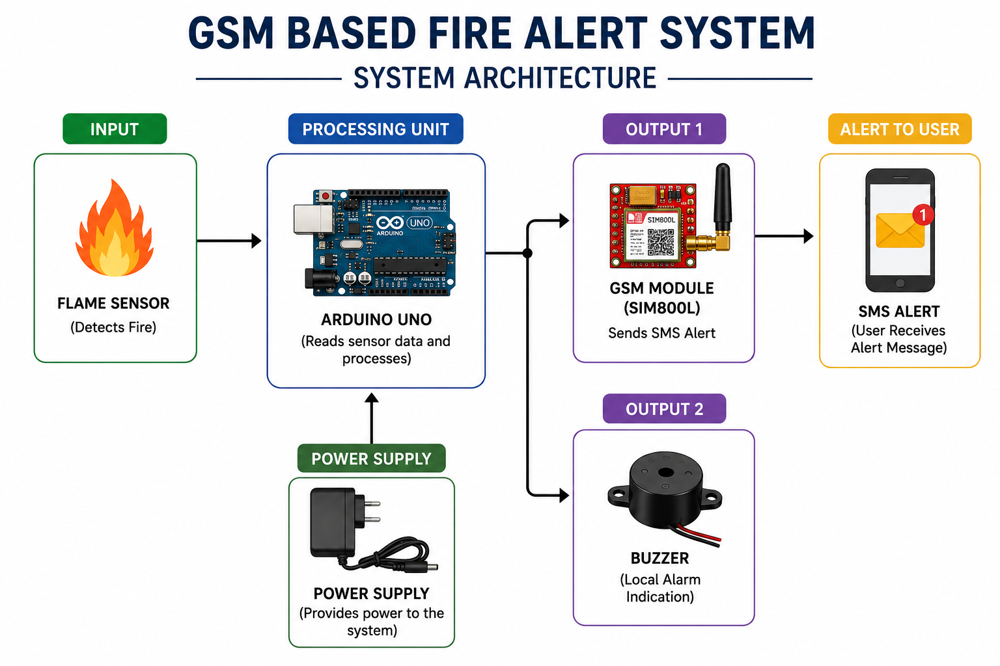
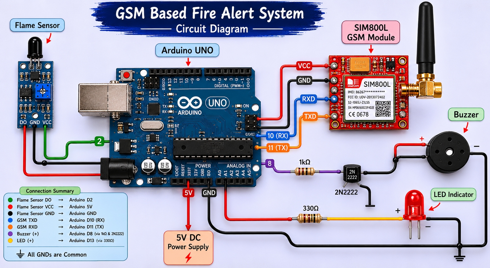

<h1 align="center">🔥 GSM Based Fire Alert System</h1>

Arduino-based fire detection and emergency SMS alert system using GSM communication.

  
     
  
     
  
     
  

---

# 📌 Overview

A GSM-based fire alert system designed using Arduino, flame sensors, and GSM communication modules to detect fire hazards and send emergency SMS alerts in real time.

This project was developed as an academic mini-project to explore:
- Embedded Systems
- Sensor Interfacing
- GSM Communication
- Safety & Alert Systems

---

## ✨ Features

- Real-time fire detection
- Automatic SMS alert system
- GSM communication support
- Local buzzer alarm
- Embedded safety application

---

## 🛠️ Technologies & Components Used

### Hardware
- Arduino UNO
- SIM800L / SIM900 GSM Module
- Flame Sensor
- Buzzer
- LEDs
- Breadboard
- Jumper Wires

### Software
- Arduino IDE
- Embedded C/C++

---

## ⚙️ Working Principle

The system continuously monitors the environment using a flame sensor.

When fire is detected, the Arduino processes the sensor input and activates:
- GSM module for emergency SMS alerts
- buzzer for local alarm indication

This enables quick emergency response and real-time alert communication.

---

## 🏗️ System Architecture

---

## 🔌 Circuit Diagram

> Diagram recreated for documentation purposes.

---

---

## 📚 Learning Outcomes

- Embedded systems fundamentals
- GSM communication handling
- Sensor interfacing
- Emergency alert system design
- Hardware prototyping and testing

---

## 🚀 Future Improvements

- IoT monitoring dashboard
- Mobile app integration
- Smoke + temperature sensing
- Battery backup system
- Cloud notifications

---

## 🔗 References

Project inspiration/reference:
https://youtu.be/

---

## 📝 Note

This repository serves as documentation and implementation archive of an academic hardware project.
